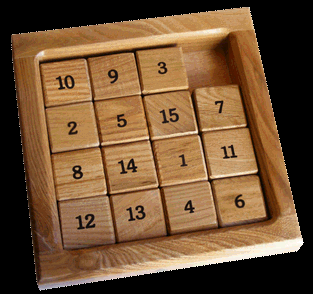

# A* Search



### Introduction

A sliding-block puzzle is a square grid of numbered blocks that can slide vertically and horizontally. The goal of the sliding block puzzle is to get the blocks arranged in order.

In this assignment, we'll use A* search to figure out a solution to an 8-puzzle game (8 blocks instead of the 15 in the above image.)

This homework is similar to the BFS maze assignment, so before you begin, make sure that you are still completely comfortable with classes and methods in python, and the idea of instances.

Recall the basic algorithm for A*:

```
A*(start state, goal state):
make finished an empty set
make frontier an empty priority queue
note the path to start is an empty list
note the priority of start is start.h(goal)
add start to frontier
until frontier is empty
    take the min-priority parent off frontier
    stop if parent is the goal
    otherwise add parent to finished
    for each move from parent
        let child be the neighbor of parent via move
        if child is in neither frontier nor finished
            add child to frontier
        if the best path to child so far is through parent
            note the path to child is the path to parent followed by move
            note the priority of child is the number of moves in its path plus child.h(goal)
```

To apply this algorithm to a 8-puzzle, think of grid locations as vertices. The "children" of a grid location are the ones that can be reached by moving one block into the empty space via the four cardinal directions (north, south, east, west). The heuristic function `h` estimates the number of moves it will take to get to the goal configuration.

## Implementation

A `Puzzle` class and an `Agent` class have been started for you below. Once you complete the indicated methods, you will be able to watch a puzzle being solved. Adjust the height of your console window to match the puzzle height, so that each display appears in the same place.

In this implementation, let's represent possible moves (the four cardinal directions) using the strings `'N', 'S', 'E', 'W'`.

After completing the three methods marked "YOU FILL THIS IN", your `eightpuzzle.main` driver method 
should work. Simulate the maze by executing the `main` (similar to HW0).

**Algorithm notes:**

- You will need to decide on a heuristic function. Remember that a good heuristic is quick to calculate and comes close to the true distance to the goal without going over.
- You will need to keep track of the sequence of moves by which you discovered each location. The pseudocode above doesn't address this, so the way you do it is up to you.

**Python notes:**

- If you want to put `Puzzle` objects into sets or use them as dictionary keys, remember to overload the `__hash__` and `__eq__` and `__ne__` methods of the `Puzzle` class.

## Autograding / Testing

Keep your 8 puzzle implementation program named `eightpuzzle.py`. 

There are three functions that I'll be testing:

1. `moves`(3 x 5 pts = 15 pts)
2. `neighbor`(3 x 7 pts = 21 pts)
3. `astar`(3 x 13 pts = 39 pts)

The pytest methods are located in `eightpuzzle_tester.py`. Execute the pytests the same as HW0. Feel free to 
include additional tests as long as you don't overwrite my original tests.

## CSC575 Only:

(25 pts.)

Write a 1-2 page report that includes a table which empirically summarizes 
the speed performance of A* on 8-puzzle using at least two heuristics (e.g. misplaced tiles, manhattan distance, etc.) 
Use the python `time` module or PyCharm's profiling tools to log how long the search agent takes to find a solution.

Write one additional local search agent: random walk. Simulate this agent N times. Include in your 
report the following answers:
* What % of times does the random agent find a solution?
* When it finds a solution, how long does it take on average?

Also code a local search hill climbing agent. Try it on both of your 
heuristics.
* Did they also find a solution?
* How long did they take compared to A* and random walk?

## Submission Instructions

Submit this assignment by pushing/committing into our GitHub organization, exactly like HW 0. 
Test your project locally 
using pytest before pushing/committing. You may push/commit multiple times. Look at the Actions report on the 
repository to double check the most recent result of the unit tests.

## Acknowledgements

The initial structure for this assignment was motivated by Lisa Torrey's 2016 Model AI Assignments contribution.

